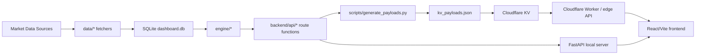

# 아키텍처

작성 기준일: 2026-06-28

## 전체 구조

## 런타임 2가지

### 1. 로컬 개발

- Backend: `uvicorn backend.main:app --reload --port 8000`
- Frontend: `cd frontend; npm run dev`
- DB: workspace root의 `dashboard.db`
- API docs: `http://localhost:8000/docs`

### 2. Cloudflare 배포

- GitHub Actions runner가 Python 엔진과 FastAPI route function을 in-process로 호출합니다.
- 결과를 `kv_payloads.json`으로 직렬화합니다.
- `wrangler kv bulk put`으로 Cloudflare KV에 업로드합니다.
- Cloudflare edge API가 KV key를 읽어 응답합니다.

현재 workspace에는 Worker source 또는 `wrangler.toml`이 없습니다. Cloudflare route, Worker name, public URL은 별도 확인이 필요합니다.

## 주요 레이어

| 레이어 | 책임 | 주요 파일 |
|---|---|---|
| Data fetch | 외부 데이터 조회 | `data/*.py` |
| Store | SQLite schema, upsert, read-through cache | `backend/store/db.py`, `backend/store/ingest.py` |
| Engine | 판단 모듈, rulebook, cascade | `engine/` |
| API | route별 payload assembly | `backend/api/` |
| Payload generation | API 응답을 KV bulk 형식으로 변환 | `scripts/generate_payloads.py` |
| UI | dashboard rendering | `frontend/src/` |

## 설계 원칙

- 데이터를 못 가져오면 임의값으로 채우지 않고 `null`, `unknown`, degraded 상태로 처리합니다.
- 계산 결과와 수동 판단값을 분리합니다. 판단값은 `config.json`, 콘텐츠는 `sectors.json`, 시계열과 계산 이력은 `dashboard.db`에 둡니다.
- GitHub Actions와 Cloudflare KV는 서버 비용을 줄이기 위한 정적 API 배포 계층입니다.
- 배포 payload와 로컬 API는 같은 route function을 사용해 동작 차이를 줄입니다.
